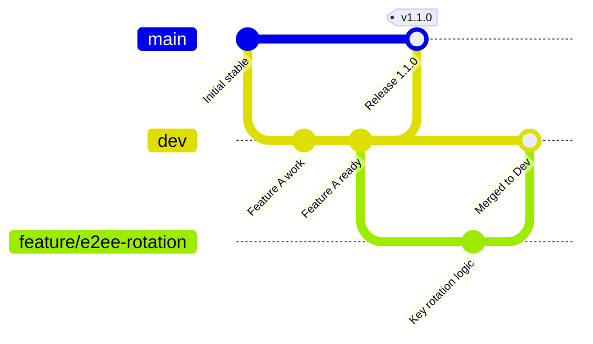

# 🌌 Tribes.app — The Privacy-First Social Hub

Welcome to **Tribes.app**, a modern, beautiful, and open-source social communication platform built with a deep commitment to **End-to-End Encryption (E2EE)** and a state-of-the-art **Concentric Rings UX** design. 

Unlike traditional platforms that sell your interactions, Tribes isolates your digital life into secure, context-aware circles—giving you absolute control over who sees what, with cryptographically enforced guarantees.

---

## 🎨 Cryptographic UX Architecture

Tribes is built around a **Post-First, Scope-After** model utilizing **Concentric Rings** to define the privacy boundaries of every post:


1. **Journal (Solo)**: Private by default. Your personal encrypted space. Posts are promotional-only (e.g. pinned to your profile wall).
2. **Inner Circle (Pairwise/Close)**: The closest circle of bonds. Uses custom cryptographic rings.
3. **My People (Broad Friends)**: Your general social circle.
4. **My Tribes (Group-Based)**: Shared spaces centered around themes, organizations, or private groups.
5. **Mood Streams (Discovery)**: Promotion-only streams curated and promoted by tribe founders to public/mood discovery streams.

---

## 🛡️ End-to-End Encryption Models

To enforce this architecture, Tribes integrates three specialized E2EE models:

*   **Journal Model (Personal Key)**: Content is encrypted using a client-derived AES key unique to the user, backed up securely via an encrypted PRF Key Vault (utilizing passkey credentials).
*   **Bond Rings (Pairwise Sender Keys)**: Dynamic, pairwise-derived sender key chains secure direct posts and messages in concentric rings. If a bond is revoked, keys rotate automatically.
*   **Private Tribes (Group Symmetric Key)**: Tribe posts are encrypted utilizing a shared group key. Solo-founder private tribes use a public status-safe encryption guard to prevent leakage before other members join.

---

## 🌲 Git Branching & Lifecycle Model

To ensure high-quality software delivery and a secure codebase, Tribes implements a strict branching model:



### Branches

*   **`main` (Production & Stable)**:
    *   Represents the current production-deployed release.
    *   **Protected Branch**: Push access is locked. Code enters `main` only via pull requests from `dev`.
    *   **Automated Release**: Merges to `main` trigger the zero-downtime blue/green deployment workflow to the production servers.
*   **`dev` (Active Integration)**:
    *   The primary integration environment for active contributors.
    *   All pull requests for new features, bug fixes, and security patches target `dev`.
    *   Once a cycle is fully validated on local/UAT environments, `dev` is merged into `main`.
*   **`feature/*` / `bugfix/*`**:
    *   Isolated branches created by developers for single features or fixes.
    *   Gated by continuous integration testing before merging into `dev`.

---

## 🛠️ Technology Stack

*   **Framework**: [Next.js](https://nextjs.org/) (App Router & Server Actions)
*   **Language**: [TypeScript](https://www.typescript.org/) (Strict compilation check)
*   **Database ORM**: [Drizzle ORM](https://orm.drizzle.team/)
*   **Databases**: PostgreSQL (Production) / Turso & SQLite (Local testing)
*   **Styling**: Vanilla CSS & Tailwind CSS
*   **Native Packaging**: [Capacitor](https://capacitorjs.com/) (iOS & Android native bridges)
*   **Runtime & Packaging**: Docker & Caddy Reverse Proxy
*   **CI/CD**: GitHub Actions

---

## 🚀 Local Quickstart Guide

### Prerequisites
*   **Node.js**: v20 or v22 (LTS)
*   **Package Manager**: `npm`

### 1. Setup Environment
Clone the repository and copy the environment variables file:
```bash
cp .env.example .env.local
```
Fill in the database, encryption vaults, and verification keys in `.env.local`.

### 2. Install Dependencies
```bash
npm install --legacy-peer-deps
```

### 3. Apply Schema Migrations
Generate and run local SQLite migrations:
```bash
npx drizzle-kit generate
npx drizzle-kit push
```

### 4. Seed the Database
Populate local tables with test fixtures:
```bash
npm run seed
```

### 5. Launch the Development Server
```bash
npm run dev
```
Open [http://localhost:3000](http://localhost:3000) to interact with the application.

---

## 🧪 Testing Suites

Before submitting any Pull Request, ensure that all compilation and test checks pass.

*   **Typecheck validation**:
    ```bash
    npm run typecheck
    ```
*   **Unit & Integration Tests** (Vitest):
    ```bash
    npm run test
    ```
*   **End-to-End Tests** (Playwright):
    ```bash
    npx playwright test
    ```

---

## 🚢 Production Deployment

Tribes features a **zero-downtime, blue/green deployment strategy** configured on Hetzner VPS instances under a Caddy reverse proxy:

*   **Image Management**: The pipeline preserves the previous docker image as `tribes-app:rollback` before rebuilding.
*   **Database Security**: Versioned migrations are validated and applied via a temporary builder container using `drizzle-kit migrate`. If a migration fails, the deploy aborts instantly.
*   **Swap Strategy**: The workflow spins up the inactive container color (blue or green), verifies its health endpoint, reloads the Caddy reverse proxy config, and safely stops the older container color with **0ms downtime** to clients.

This is executed automatically upon merging code into `main` via `.github/workflows/deploy.yml`.

---

## 📄 License

This project is licensed under the **MIT License**. See the [LICENSE](LICENSE) file for details.
