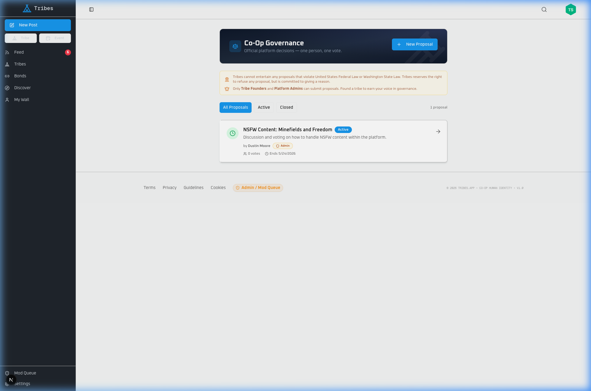

# Dev Update: Governance, Clean URLs, and Deploy Hardening

Another big build day. Here's what shipped:

---

## 🏛️ Co-Op Governance Is Live

The voting and proposal system is ready for founding members:

- **Threaded proposal debates** — nested replies with a restricted three-reaction system (👍 😐 👎)
- **Proposal creation for Founders** — if you've founded a tribe (even a private one), you can submit platform proposals. You're investing in Tribes, you get a voice
- **Admin notifications** — site admins are alerted whenever a founder submits a new proposal
- **Legal framework** — "Tribes reserves the right to refuse any proposal, but is committed to giving a reason."
- **Vote gate** — only paid co-op members can vote. Additional gates (account age, reputation) will activate after the founding phase

## 🔗 Slug-Based URLs Are Live

Every user and tribe now has a clean URL. All 112 existing users were backfilled:

| Before | After |
|--------|-------|
| `/profile/ebdee0d3-7ceb-4496...` | `/u/dustin-moore` |
| `/profile/96ad9e63-b9c6-49f6...` | `/u/richard-ashbaugh` |
| `/tribes/a5b2c3d4-e5f6-7890...` | `/t/mini-owners-in-the-north-of-england` |

Old UUID routes still work via redirect — no bookmarks broken.

## ✏️ Comment Editing Everywhere

The tribe-specific comment card was missing the Edit option. Fixed — you can now edit your comments from anywhere: post detail, tribe page, feed.

## 🔧 Deploy Pipeline Hardened

We caught a gap in our deploy process and locked it down. Database migrations now hard-abort the deploy if anything goes wrong — no more deploying code that expects schema changes that didn't land. We also added a rollback script that restores the previous build in under 10 seconds.

---

## Deploy Pipeline Summary

| Step | Old | New |
|------|-----|-----|
| Schema sync | `drizzle-kit push --force` (interactive, destructive) | `drizzle-kit migrate` (versioned SQL files) |
| Migration failure | Warn and continue deploying broken code | **HARD ABORT** — old deployment stays live |
| Rollback image | None — both colors use same broken image | `tribes-app:rollback` preserved before every build |
| Recovery | Manual SSH + Docker commands (~15min) | `./scripts/rollback.sh` (~10 seconds) |

---

## What's Next

- **100th user milestone** — we're close. Something fun is coming for that
- Mobile polish continues — drawer menus, keyboard handling, touch targets
- Governance opens to all founding members for the first platform vote
- Encryption key sync improvements based on real-world usage data

As always, bugs and ideas go right here. We're building this together.

---

**Tags:** `#devupdate` `#devops` `#governance` `#security`

